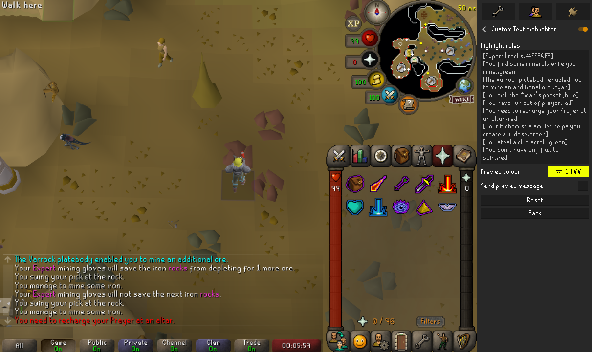
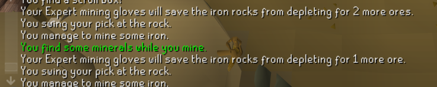
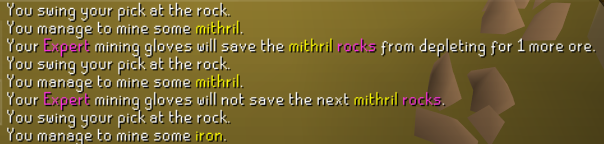
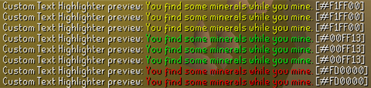
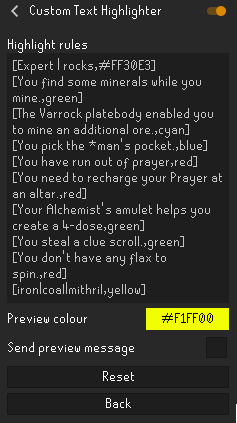

# Custom Text Highlighter
### Version 1.0

Customize the color of any in-game chat message using simple rules.

## Features

- Highlight any game message
- Preview your top-most rule in-game
- Supports named colours (red, green, purple, cyan, etc.) and hexadecimal colours (#RRGGBB)
- Wildcard support
    - \* = word prefixes, suffixes, or in between
    - ? = one character
    - | = OR
- Unlimited rules

## Screenshots


### Highlighting game messages





### Plugin configuration



## Rule Examples

```text
[Expert,#FF30E3]
[minerals,green]
[You pick the *man's pocket.,red]
[iron|coal|mithril,yellow]
```

## Donations

If you've found **Custom Text Highlighter** useful and would like to support future development, you can buy me a coffee:

☕ https://paypal.me/twitchplaying